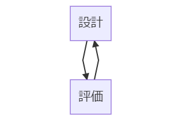
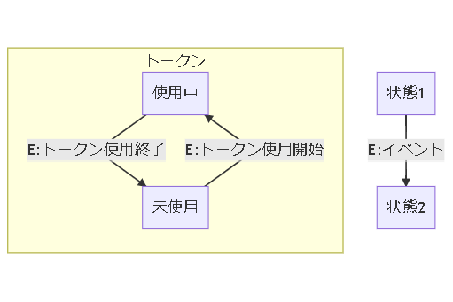
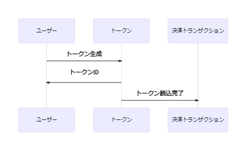
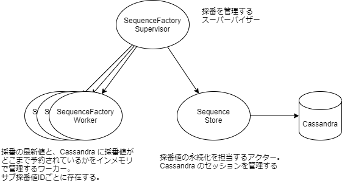

# 内部設計ガイド

## 内部設計を始める前提条件

- 外部設計[1](#note1)が確認できる状況であること
    - 実装する機能のインプットとアウトプットを把握する必要があります
- 業務フローが確認できる状況であること
    - システムのユースケースを大局的に把握しておくことは内部設計の助けになります

## 内部設計の関心事

内部設計ではシステム内部の「状態」と「振る舞い」に焦点を当てます。

## 内部設計の目的

本書では内部設計を実施する目的を下記のように想定します。
作成する成果物は、開発メンバーに共有可能なドキュメントです。

### プログラミング工程での手戻りを減らす

内部設計のドキュメントを共有することで、設計者の理解が可視化されます。可視化された設計を開発メンバー間で共有し、議論を重ねて設計を洗練させることができます。事前に設計を洗練させることでプログラミング工程での手戻りや技術的負債の作り込みを減らす効果が期待できます。

### 開発メンバー間で設計/実装する対象への共通理解を作る

設計について議論を重ねていくうちに開発メンバー間で設計/実装する対象への共通理解が形成されることが期待できます。これによりペアプログラミングやコードレビューといった共同作業がしやすくなります。

### ホワイトボックステストのテストケースを作成する

システム内部の状態や振る舞いが一覧できるようになっていると、ホワイトボックステストのテストケースを設計者以外のメンバーが作成しやすくなります。

## 内部設計書の想定読者

本書では内部設計書の想定読者を下記のように想定します。

- システム内部の仕様を設計する開発メンバー
- プログラムを実装する開発メンバー

## 内部設計の流れ

設計には試行錯誤が伴います。様々な要件や制約を加味して検討していく必要があるため（場合によっては要件や制約を設計中に発見する必要があることも…）、機械的に設計を導くのは難しいです。設計作業はたいてい下記のような手順で行われると言って良いでしょう。

設計のスナップショットに対して考慮漏れなどがないか評価します。評価した結果は設計へとフィードバックします。

## 本書が提供するもの

本書では Lerna Stack を用いるシステムの内部設計において、「設計」を表現するのに役立つ図表の紹介と、「評価」を助けるチェックリストを提供します。

別紙の「内部設計サンプル」を足がかりに、本書が提供するものを活用しながら内部設計を行ない、内部設計についてチーム内で議論してください。

## 図表

設計する対象と目的によって適切な図表は異なります。
システムの状態変化を伴う複雑な処理を設計する場合、本章に示す全ての図表を用意しておくことを推奨しますが、取捨選択する場合は各図表の用途を参考に判断してください。

### 状態遷移図

- 用途
    - 状態が変わるきっかけと、状態が変わる際に辿る経路の理解を助ける

### コマンド-イベント変換表

- 用途
    - イベントの発生タイミングを明確にする
    - 振る舞いを明確にする

縦軸には現在の状態、横軸にはコマンドを書き、交差する各マスにはアクションと発生させるイベントを記載します。

|コマンド→ ↓状態|コマンド1|コマンド2|
|--|--|--|
|**状態1**|アクション1 **▶ イベント1**|アクション2 **▶ イベント2**|
|**状態2**|アクション3 **▶ イベント3**|アクション4 **▶ イベント4**|

#### 例

|コマンド→ ↓状態|トークン確保|トークン開放|
|--|--|--|
|**未使用**|有効期限タイマーをセット トークンを返却 **▶ トークン貸出完了**|NoOp **▶ -**|
|**使用中**|エラーを返却 **▶ -**|有効期限タイマーをリセット **▶ トークン返却確認済**|

### 状態遷移表

- 用途
    - 状態遷移の経路に漏れがないかをチェックする
    - 状態遷移できない経路を明確にする

縦軸には現在の状態、横軸にはイベントを書き、交差する各マスには状態遷移先の状態と、必要に応じてイベントに記録する情報を記載します。

|イベント→ ↓状態|イベント1|イベント2|
|--|--|--|
|**状態1**|**▶ 状態a**|**▶ 状態b**|
|**状態2**|**▶ 状態c**|**▶ 状態d**|

#### 例

|イベント→ ↓状態|トークン貸出完了|トークン返却確認済|
|--|--|--|
|**未使用**|使用開始日時を記録 **▶ 使用中**|**▶ -**|
|**使用中**|**▶ -**|**▶ 未使用**|

### シーケンス図

- 用途
    - システムの振る舞いの理解を助ける
    - イベントが発生するきっかけの理解を助ける

### スーパーバイザーヒエラルキー図

- 用途
    - アクター（状態）の境界を理解しやすくする
    - 予期しない例外が発生した場合に状態がリセットされる単位の理解を助ける

## 内部設計のチェックリスト

### 整合性

#### レスポンスから宛先の状態を推定できない場合の振る舞いが考慮されているか？

宛先のシステムの状態を更新する操作を行う場合は、処理が失敗した際にこちらのシステムとの整合性が崩れないことを考慮しましょう。

例えば HTTP でリクエストした場合は、レスポンスが長時間受け取れず、タイムアウトになったケースや、5xx（サーバーサイドエラー）系のステータスコードでレスポンスが返却された場合のケースを考慮します。レスポンスを元に、RDBMS のデータを更新したり、何らかシステムの状態を更新したりするような処理がある場合は、宛先システムの状態とこちら側のシステムの状態で整合性が崩れている可能性があります。

このような場合は、宛先のシステムへもう一度同じ操作をリクエストするか、更新を打ち消す操作をリクエストする方法（補償トランザクション）があります。同じ操作をリクエスト可能か、操作の打ち消しが可能かは宛先のシステムの仕様によって異なります。宛先システムの外部設計などに記載が無い場合は確認しましょう。

可用性の観点ではもう一度同じ操作をリクエストするほうが有利です。クライアントがリクエストした操作が成功する確率が高まるためです。ただし、外部システムに再度同じ操作をリクエストする場合はその操作に冪等性[2](#note2)があることを確認してください。

再度リクエストした操作が2度目で成功する保障はありません、また打ち消しの操作が1度目で成功する保障もありません。整合性が崩れるリスクを小さくするためにはリトライが必要です。リトライを行う場合は、リトライの上限を設けるのか無限にリトライするのか、上限を設けた場合はその上限を超えた場合はどうするかといった考慮も必要になります。

### タイムアウト

#### 応答が長時間返ってこなかった際にタイムアウトすることを検討しているか？

外部システムからの応答待ちや DB のクエリの結果待ちなどで想定よりも時間がかかった場合はタイムアウトにより処理を中断させることが重要です。タイムアウトせずに無限に待ち続けるとサーバーのポートや DB のコネクションプールなど、有限のリソースを無駄に消費し、大きな障害を誘発する可能性があるからです。ユーザビリティを損なう可能性もあります（永遠に終わらないローディング画面を想像してみてください）。

タイムアウトした際のシステムの振る舞いを検討しておきましょう。例えば、クライアントにエラーを返す、または処理をリトライさせるといった対処方法があります。

クライアントにエラーを返す際は、新たなエラーコードを定義するよう外部設計を見直す必要があるかもしれません。

#### 待ち状態で身動きが取れなくなるケースはないか？

状態遷移図を見返してみて、それぞれの状態でタイムアウトの検討が必要ないかをチェックしてみましょう。外部システムからの応答を待ったりする状態では、タイムアウトを発生させ強制的に他の状態に遷移させる必要があるかもしれません。

待ち状態で、新たにリクエストされたあらゆる操作を保留させるような場合は、応答が得られなかった場合に身動きが取れなくなるため要注意です。

### Let It Crash

#### 予期しないエラーが発生した場合は状態をリセットすることを検討しているか？

予期しないエラーが発生した場合は、システム内のインメモリで持つ情報やキャッシュなどは可能な限り破棄し、再起動するという方法で復旧させたほうが可用性の点で有利です。予期しないエラーの原因がインメモリで持っている情報やキャッシュである可能性があるからです。

ただし、この復旧に時間がかかり、逆に可用性を下げる可能性がある場合は破棄を避けます。
破棄されると困る重要な情報は復元できるように永続化します。

### フェイルファスト

#### 整合性の維持が重要な処理の前には更新処理を行う前にヘルスチェックする

クライアントからあるリクエストを受けた際に、複数の外部システムの状態を更新する、複数の DB を更新するといった操作がある場合は、各システムが利用可能かをチェックした後で実際に操作することを検討しましょう。トランザクションが複数に分かれているため、一部の操作だけ成功し、一部の操作は失敗するといった状況に陥る可能性があります。

失敗を検知した後にリトライや取り消しによりこの「中途半端な」状態から回復できる可能性はありますが、それらはリソースや時間を多く消費しがちです。事前に操作対象のシステムの状態を確認し、中途半端な状態へ陥る前に処理を中断し、クライアントへいち早くエラーを通知するほうが望ましいです。

### 言葉の定義

#### イベントの命名方法

例えば外部システムに決済処理を委譲し、その状態を管理する「決済トランザクション」というエンティティ[3](#note3)があるとします。外部システムに委譲した決済処理が成功した場合、そのイベントは「決済成功」と命名するよりも「決済成功確認」と命名するほうが望ましいです。

命名が望ましい形になっているかどうかは、エンティティを主語、イベントを述語としたときに意味が通るかどうかをチェックしてみましょう。「**決済トランザクション**が**決済成功**した」よりも「**決済トランザクション**が**決済成功**を**確認**した」と表現したほうが「外部システムに決済処理を委譲し、その成功を確認した」ということが理解しやすいと思います。

---
1. 本書では「外部システム・サブシステム・ユーザーとインターフェイスを合意するための設計」とみなしています。例えば、HTTP API の仕様や、画面定義、共通利用する（RDBMSの）テーブル定義などが含まれると想定しています。  
2. 同じ操作を何度繰り返しても、常に同じ結果が得られるという性質。  
3. 状態変更のライフサイクルを管理する必要があるものをエンティティと呼びます  
