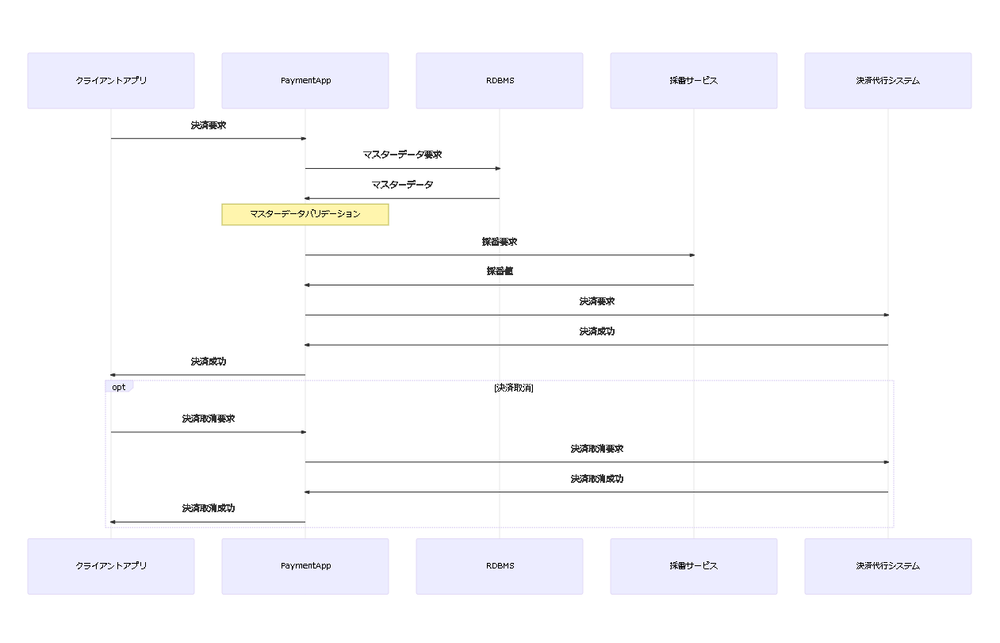
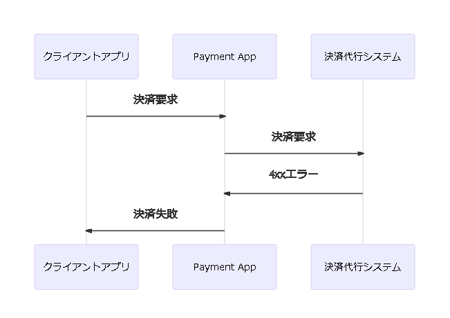
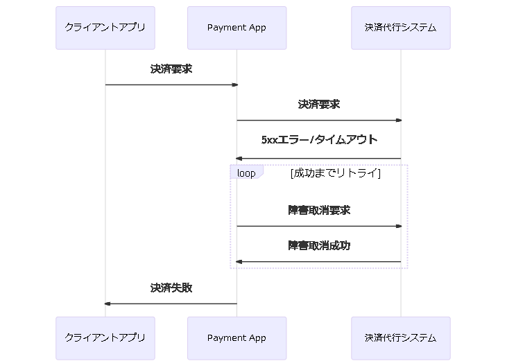
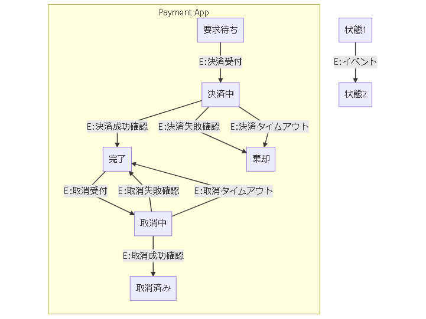

# 内部設計サンプル： 決済機能

## 制約事項など

- 決済代行システムの決済要求は冪等な操作ではないため、リトライは不可（2重決済になってしまう）
- 決済代行システムの障害取消要求は冪等な操作のため、リトライ可

## シーケンス図

### 正常系

### 異常系（決済代行システムの状態確定）

4xx系エラーの場合、決済が成功していないことが確定している。

### 異常系（決済代行システムの状態不定：障害取消成功）

5xx系エラー、またはタイムアウトの場合は決済代行システム内部では決済処理が成功している可能性がある。
本システム側では決済が失敗したとみなされるため、決済代行システムと整合性を合わせるために障害取消を行う。
障害取消のリトライはリソース負荷が過剰に上がらないように 2 回に限定する。

## 状態遷移

### 状態遷移図

### コマンド-イベント変換表

|コマンド→ ↓状態|決済要求|決済成功通知|決済失敗通知|決済タイムアウト通知|取消要求|取消成功通知|取消失敗通知|取消タイムアウト通知|
|--|--|--|--|--|--|--|--|--|
|**要求待ち（初期値）**|++パラメーターやデータに不備がある場合：++ エラーを返却 **▶ 決済中断** ++上記以外の場合：++ 決済代行へ決済要求 **▶ 決済受付**|NoOp **▶ -**|NoOp **▶ -**|NoOp **▶ -**|エラーを返却 **▶ -**|NoOp **▶ -**|NoOp **▶ -**|NoOp **▶ -**|
|**決済中**|コマンド保留 **▶ -**|決済失敗結果を返却 **▶ 決済成功確認**|タイムアウト/5xx系エラーの場合は障害取消 決済失敗結果を返却 **▶ 決済失敗確認**|決済失敗結果を返却 **▶ 決済タイムアウト**|エラーを返却 **▶ -**|NoOp **▶ -**|NoOp **▶ -**|NoOp **▶ -**|
|**決済要求成功**|決済成功結果を返却 **▶ -**|NoOp **▶ -**|NoOp **▶ -**|NoOp **▶ -**|++パラメーターやデータに不備がある場合：++ エラーを返却 **▶ 取消中断** ++上記以外の場合：++ 決済代行へ取消要求 **▶ 取消受付**|NoOp **▶ -**|NoOp **▶ -**|NoOp **▶ -**|
|**決済要求失敗**|決済失敗結果を返却 **▶ -**|NoOp **▶ -**|NoOp **▶ -**|NoOp **▶ -**|エラーを返却 **▶ -**|NoOp **▶ -**|NoOp **▶ -**|NoOp **▶ -**|
|**取消中**|エラーを返却 **▶ -**|NoOp **▶ -**|NoOp **▶ -**|NoOp **▶ -**|コマンド保留 **▶ -**|取消成功結果を返却 **▶ 取消成功確認**|タイムアウト/5xx系エラーの場合は障害取消 取消失敗結果を返却 **▶ 取消失敗確認**|取消失敗結果を返却 **▶ 取消タイムアウト**|
|**取消要求成功**|エラーを返却 **▶ -**|NoOp **▶ -**|NoOp **▶ -**|NoOp **▶ -**|取消結果を返却 **▶ -**|NoOp **▶ -**|NoOp **▶ -**|NoOp **▶ -**|

### 状態遷移表

|イベント→ ↓状態|決済受付|決済成功確認|決済中断|決済失敗確認|決済タイムアウト|取消受付|取消成功確認|取消中断|取消失敗確認|取消タイムアウト|
|--|--|--|--|--|--|--|--|--|--|--|
|**要求待ち（初期値）**|**▶ 決済中**|**▶ -**|**▶ -**|**▶ -**|**▶ -**|**▶ -**|**▶ -**|**▶ -**|**▶ -**||
|**決済中**|**▶ -**|**▶ 決済要求成功**|**▶ 決済要求失敗**|**▶ 決済要求失敗**|**▶ 決済要求失敗**|**▶ -**|**▶ -**|**▶ -**|**▶ -**|**▶ -**|
|**決済要求成功**|**▶ -**|**▶ -**|**▶ -**|**▶ -**|**▶ -**|**▶ 取消中**|**▶ -**|**▶ -**|**▶ -**|**▶ -**|
|**決済要求失敗**|**▶ -**|**▶ -**|**▶ -**|**▶ -**|**▶ -**|**▶ -**|**▶ -**|**▶ -**|**▶ -**|**▶ -**|
|**取消中**|**▶ -**|**▶ -**|**▶ -**|**▶ -**|**▶ -**|**▶ -**|**▶ 取消要求成功**|**▶ 決済要求成功**|**▶ 決済要求成功**|**▶ 決済要求成功**|
|**取消要求成功**|**▶ -**|**▶ -**|**▶ -**|**▶ -**|**▶ -**|**▶ -**|**▶ -**|**▶ -**|**▶ -**|**▶ -**|

### 辞書

|和名|英名|
|--|--|
|**ステート**||
|要求待ち|WaitingForRequest|
|決済中|Settling|
|完了|Completed|
|失敗|Failed|
|取消中|Canceling|
|取消済み|Canceled|
|**コマンド**||
|決済する|Settle|
|取消する|Cancel|
|**購読イベント（外部システムのレスポンス）**||
|決済結果|SettlementResult|
|- (決済成功)|- SettlementSucceeded|
|- (決済失敗)|- SettlementFailed|
|- (決済タイムアウト)|- SettlementTimedOut|
|取消結果|CancelResult|
|- (取消成功)|- CancelSucceeded|
|- (取消失敗)|- CancelFailed|
|- (取消タイムアウト)|- CancelTimedOut|
|**発行イベント**||
|決済受付した|SettlementAccepted|
|決済成功確認した|SettlementSuccessConfirmed|
|決済中断した|SettlementAborted|
|決済失敗確認した|SettlementFailureConfirmed|
|決済タイムアウトを検出した|SettlementTimeoutDetected|
|取消受付した|CancelAccepted|
|取消成功確認した|CancelSuccessConfirmed|
|取消中断した|CancelAborted|
|取消失敗確認した|CancelFailureConfirmed|
|取消タイムアウトを検出した|CancelTimeoutDetected|
